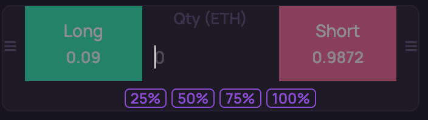
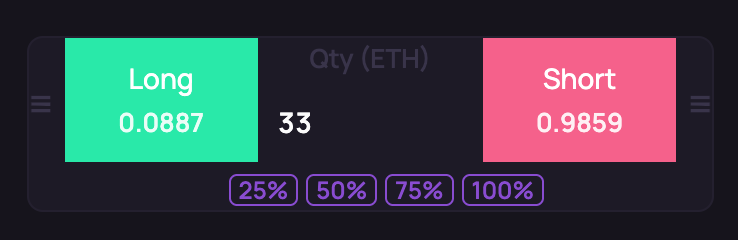
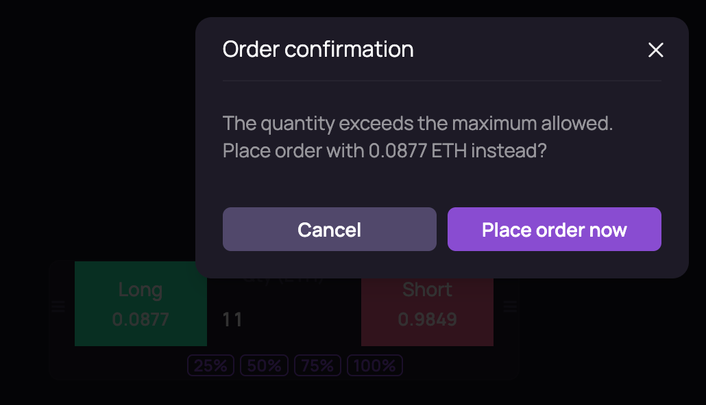

# @orderly.network/fast-place-order-plugin

A fast-place-order plugin for the Orderly SDK. Mounts a **draggable quick-order widget** next to the trading UI for one-click market buy/sell, quantity by percentage, and max-quantity confirmation.

<!--  -->


## Features

### Quick Market Orders

Shows a quick-order panel beside the trading view so you can place market buy/sell orders without switching to the order form. Supports custom quantity or preset percentages (25%/50%/75%/100%).



### Draggable Floating Widget

The widget can be dragged to reposition and does not block the main trading area. It stays visible with the trading view for fast access.



### Max Quantity Confirmation

Using 100% or large quantities triggers a confirmation dialog to avoid mistakes. Supports i18n and Orderly SDK theming.

## Quick Start

### Installation

```bash
npm install @orderly.network/fast-place-order-plugin
# or
pnpm add @orderly.network/fast-place-order-plugin
# or
yarn add @orderly.network/fast-place-order-plugin
```

### Register the Plugin

```tsx
import { registerFastPlaceOrderPlugin } from "@orderly.network/fast-place-order-plugin";

const plugins = [
  registerFastPlaceOrderPlugin({
    className: "my-fast-place-order", // optional
  }),
];
```

Pass the `plugins` array to `OrderlyAppProvider`:

```tsx
<OrderlyAppProvider
  plugins={plugins}
  configStore={configStore}
  // ...other props
>
  {children}
</OrderlyAppProvider>
```

### Options

| Option      | Type     | Required | Description                                      |
|------------|----------|----------|--------------------------------------------------|
| `className`| `string` | No       | CSS class name for the quick-order widget wrapper |

### Peer Dependencies

This plugin requires the following Orderly SDK packages:

- `@orderly.network/hooks`
- `@orderly.network/plugin-core`
- `@orderly.network/i18n`
- `@orderly.network/types`
- `@orderly.network/ui`
- `@orderly.network/utils`
- `react` >= 18
- `react-dom` >= 18
